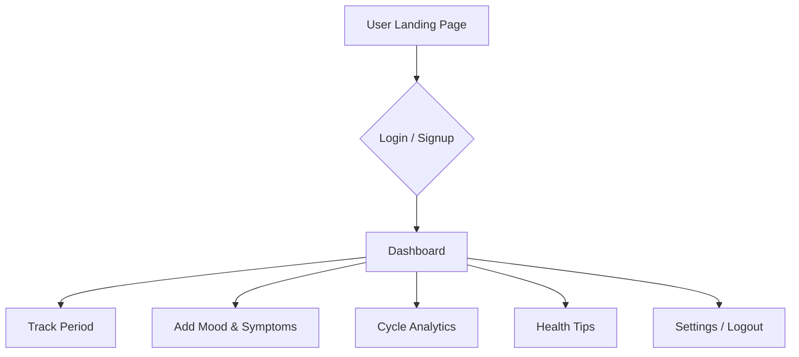

# 🌸 Her Cycle – Your Menstrual Wellness Companion 💕

> *"Because every cycle deserves care, comfort, and awareness."*


---

## 🧠 About the Project

**Her Cycle** is a thoughtfully designed web app focused on women's health – offering cycle tracking, period predictions, mood logs, and wellness tips. Built with empathy and tech, it aims to break taboos and promote awareness in a private, respectful, and interactive way.
<br><br>
---

## 🌟 Why This Project?

Menstrual health still remains a topic less spoken about in many regions. With *Her Cycle*, we wanted to build something:

- That supports girls and women with intuitive tools 💡
- That encourages health tracking and better cycle understanding 📈
- That maintains privacy while providing helpful suggestions 🔐
- That’s built with love, for empowerment 💖

---

## 🧰 Tech Stack Used

| Frontend     | Backend        | Design & Tools |
|--------------|----------------|----------------|
| React.js     | Node.js        | Figma          |
| TailwindCSS  | Express.js     | Canva          |
| Redux        | MongoDB        | Flowchart Fun  |
| Framer Motion| JWT Auth       | Postman        |

---

## 🚀 Features

- 🌙 Period and Ovulation Tracker  
- 😊 Mood and Symptom Logging  
- 🔔 Personalized Reminder Alerts  
- 📊 Cycle History & Analytics  
- 🌼 Health Tips & Daily Suggestions  
- 🌐 Multilingual & Region Adaptive  
- 🧏‍♀️ Voice Entry Support (coming soon!)

---

## Getting Started


### Prerequisites

- Node.js (v18 or higher)
- npm or yarn
- Supabase account and project

### Installation

1. Clone the repository:
```bash
git clone https://github.com/RajeshKalidandi/hercycle.git
cd hercycle
```

2. Install dependencies:
```bash
npm install
# or
yarn install
```

3. Create a `.env.local` file in the root directory and add your environment variables:
```env
NEXT_PUBLIC_SUPABASE_URL=your_supabase_url
NEXT_PUBLIC_SUPABASE_ANON_KEY=your_supabase_anon_key
```

4. Run the development server:
```bash
npm run dev
# or
yarn dev
```

5. Open [http://localhost:3000](http://localhost:3000) in your browser.


---

## Project Structure

```
hercycle/
├── src/
│   ├── components/     # Reusable UI components
│   ├── contexts/       # React context providers
│   ├── hooks/         # Custom React hooks
│   ├── integrations/  # Third-party integrations
│   ├── lib/           # Utility functions
│   ├── pages/         # Next.js pages
│   └── utils/         # Helper functions
├── public/            # Static assets
└── types/            # TypeScript type definitions
```

## Contributing

1. Fork the repository
2. Create your feature branch (`git checkout -b feature/AmazingFeature`)
3. Commit your changes (`git commit -m 'Add some AmazingFeature'`)
4. Push to the branch (`git push origin feature/AmazingFeature`)
5. Open a Pull Request

## License

This project is licensed under the MIT License - see the [LICENSE](LICENSE) file for details.

## Acknowledgments

- [shadcn/ui](https://ui.shadcn.com/) for the beautiful UI components
- [Supabase](https://supabase.com/) for the backend infrastructure
- [Recharts](https://recharts.org/) for the data visualization components

## Support

For support, email support@hercycle.com or join our Slack channel.


---

## 📸 Snapshots

### 🖼️ Main UI


---

### 🔍 Snip Tools, Design, and Flow

<div align="center">
  
  
  
</div>

---


## 🔄 Project Structure Flowchart




## 💅 UI/UX Suggestions for More Attraction
Use Glassmorphism cards with soft pink gradients and shadows

Animate with Framer Motion for transition pop-ups and feedback

Implement dark/light toggle with smooth transitions

Add progress ring around days tracked

Add chatbot assistant (for FAQs or insights)

Use Lottie animations for mood selection 😊

---

## 🧑‍💻 Connect With Me
Hey! I'm Gayatri G – a frontend developer who loves building emotionally intelligent, visually rich applications ✨

Let's connect and collaborate 🚀:

<div align="center"> <a href="mailto:gayatri192005@gmail.com"></a> <a href="https://www.linkedin.com/in/gayatri192005"></a> <a href="https://www.instagram.com/gayatri192005"></a> <a href="https://twitter.com/gayatri192005"></a> <a href="https://snapchat.com/add/gayatri192005"></a> </div>


---
