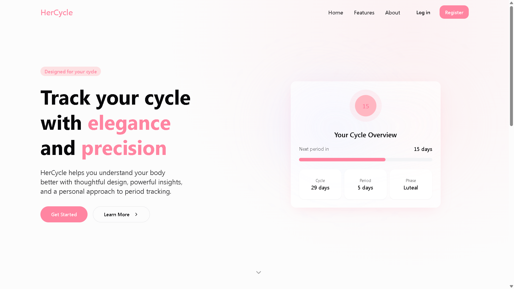

# HerCycle - Menstrual Cycle Tracking App



HerCycle is a modern, user-friendly menstrual cycle tracking application built with Next.js and TypeScript. It helps users track their menstrual cycles, symptoms, and mood patterns while providing personalized insights and predictions.

## Features

- 📊 **Cycle Tracking**: Log your period days, flow intensity, and symptoms
- 📈 **Insights Dashboard**: View personalized cycle analysis and predictions
- 📅 **Calendar View**: Visualize your cycle patterns and upcoming events
- 🎯 **Symptom Tracking**: Monitor physical and emotional symptoms
- 💡 **Personalized Tips**: Get phase-specific recommendations and symptom management advice
- 🔒 **Secure & Private**: Your data is encrypted and stored securely

## Tech Stack

- **Frontend**: Next.js, TypeScript, Tailwind CSS
- **UI Components**: shadcn/ui
- **Charts**: Recharts
- **Authentication**: Supabase Auth
- **Database**: Supabase
- **State Management**: React Context
- **Date Handling**: date-fns

## Getting Started

### Prerequisites

- Node.js (v18 or higher)
- npm or yarn
- Supabase account and project

### Installation

1. Clone the repository:
```bash
git clone https://github.com/RajeshKalidandi/hercycle.git
cd hercycle
```

2. Install dependencies:
```bash
npm install
# or
yarn install
```

3. Create a `.env.local` file in the root directory and add your environment variables:
```env
NEXT_PUBLIC_SUPABASE_URL=your_supabase_url
NEXT_PUBLIC_SUPABASE_ANON_KEY=your_supabase_anon_key
```

4. Run the development server:
```bash
npm run dev
# or
yarn dev
```

5. Open [http://localhost:3000](http://localhost:3000) in your browser.

## Project Structure

```
hercycle/
├── src/
│   ├── components/     # Reusable UI components
│   ├── contexts/       # React context providers
│   ├── hooks/         # Custom React hooks
│   ├── integrations/  # Third-party integrations
│   ├── lib/           # Utility functions
│   ├── pages/         # Next.js pages
│   └── utils/         # Helper functions
├── public/            # Static assets
└── types/            # TypeScript type definitions
```

## Contributing

1. Fork the repository
2. Create your feature branch (`git checkout -b feature/AmazingFeature`)
3. Commit your changes (`git commit -m 'Add some AmazingFeature'`)
4. Push to the branch (`git push origin feature/AmazingFeature`)
5. Open a Pull Request

## License

This project is licensed under the MIT License - see the [LICENSE](LICENSE) file for details.

## Acknowledgments

- [shadcn/ui](https://ui.shadcn.com/) for the beautiful UI components
- [Supabase](https://supabase.com/) for the backend infrastructure
- [Recharts](https://recharts.org/) for the data visualization components

## Support

For support, email support@hercycle.com or join our Slack channel.
